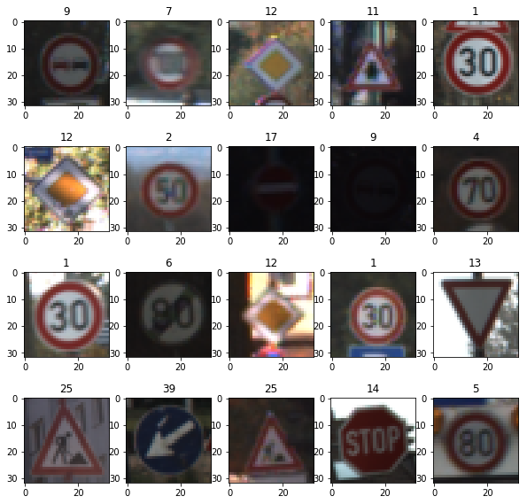
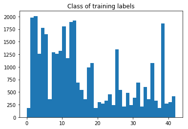
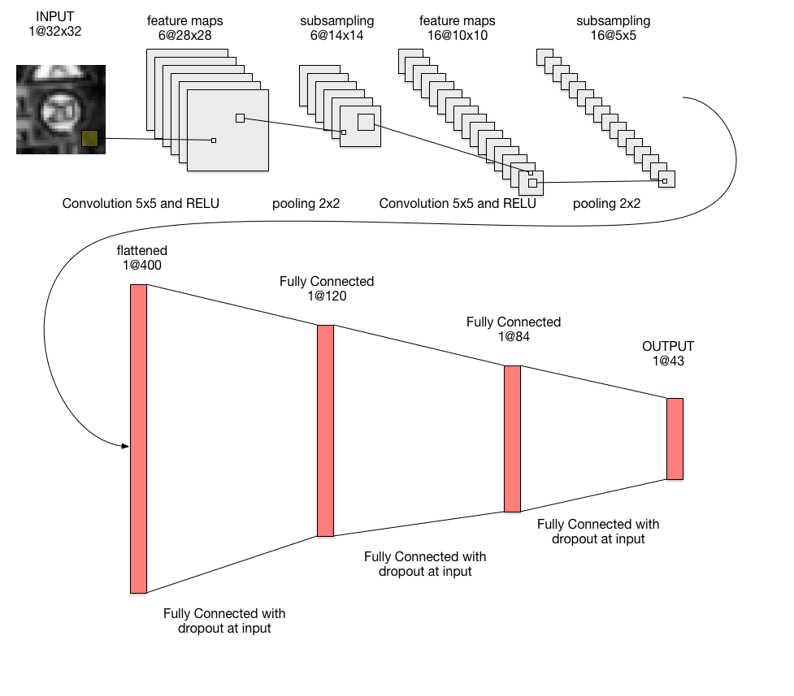
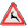
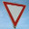
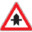
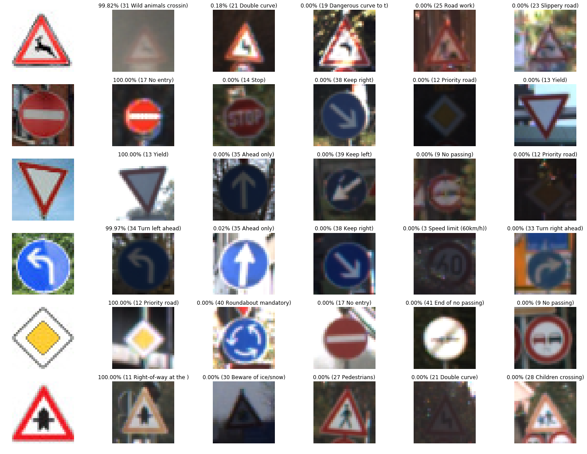

# **Traffic Sign Recognition** 

**Build a Traffic Sign Recognition Project**

The goals / steps of this project are the following:
* Load the data set (see below for links to the project data set)
* Explore, summarize and visualize the data set
* Design, train and test a model architecture
* Use the model to make predictions on new images
* Analyze the softmax probabilities of the new images
* Summarize the results with a written report

## Rubric Points
### Here I will consider the rubric points individually and describe how I addressed each point in my implementation.  

---
### 1. Load The Data
From the folder data to read the data for training, validation and testing.

### 2.Data Set Summary & Exploration

#### 1. Provide a basic summary of the data set. In the code, the analysis should be done using python, numpy and/or pandas methods rather than hardcoding results manually.

I used the numpy to calculate summary statistics of the traffic
signs data set:

* The number of training examples = 34799
* The number of validation examples = 4410
* The number of testing examples = 12630
* The image data shape = (32, 32, 3)
* The number of classes = 43

#### 2. Include an exploratory visualization of the dataset.

Random images of labels.

Classes of training labels.

### 3.Design and Test a Model Architecture

#### 1. Describe how you preprocessed the image data. What techniques were chosen and why did you choose these techniques? Consider including images showing the output of each preprocessing technique. Pre-processing refers to techniques such as converting to grayscale, normalization, etc. (OPTIONAL: As described in the "Stand Out Suggestions" part of the rubric, if you generated additional data for training, describe why you decided to generate additional data, how you generated the data, and provide example images of the additional data. Then describe the characteristics of the augmented training set like number of images in the set, number of images for each class, etc.)

My preprocessing pipeline:
* Coversion to grayscale, in order to transfer the channel of image to 1.
* Saturationg the intensity values at 1 and 99 percentile.
* Normorlizing the value of pictures to the rance [0,1].
* Substration of its mean from the image, making the values centered around 0 and in the range [-1,1] by function (pixel - 128)/128
  

#### 2. Describe what your final model architecture looks like including model type, layers, layer sizes, connectivity, etc.) Consider including a diagram and/or table describing the final model.
Architecture of model

My final model consisted of the following layers:

| Layer         		|     Description	        					| 
|:---------------------:|:---------------------------------------------:| 
| Input         		| 32x32x3 RGB image   							| 
| Convolution 3x3     	| 1x1 stride, valid padding, output=28x28x6 	|
| RELU					|												|
| Max pooling	      	| 2x2 stride, valid padding, output=14x14x6   	|
| Convolution 6x6       | 1x1 stride, valid padding, output=10x10x16    |
| RELU          		|            									|
| Max pooling			| 2x2 stride, valid padding, output=5x5x16      |  	
| Flatten				| output=400									|
| Fully connected		| input=400, output=120       					|
| RELU                  |                                               |
| Fully connected       | input=84, output=43 

#### 3. Describe how you trained your model. The discussion can include the type of optimizer, the batch size, number of epochs and any hyperparameters such as learning rate.

To train the model, I used 50 epochs, a batch size of 128 and a learning rate of 0.0008.

#### 4. Describe the approach taken for finding a solution and getting the validation set accuracy to be at least 0.93. Include in the discussion the results on the training, validation and test sets and where in the code these were calculated. Your approach may have been an iterative process, in which case, outline the steps you took to get to the final solution and why you chose those steps. Perhaps your solution involved an already well known implementation or architecture. In this case, discuss why you think the architecture is suitable for the current problem.

My final model results were:
* training set accuracy = 0.986
* validation set accuracy = 0.961
* test set accuracy = 0.939

I tried different value of parameters. With little epochs, the validation accuracy line was not stable at the end. With high epochs, the caculating time was too long. There was a little wave by the caculated accuracies.

 

### 4.Test a Model on New Images

#### 1. Choose five German traffic signs found on the web and provide them in the report. For each image, discuss what quality or qualities might be difficult to classify.

Here are five German traffic signs that I found on the web:

  
     

The Predictions: [31 17 13 34 12 11]

#### 2. Discuss the model's predictions on these new traffic signs and compare the results to predicting on the test set. At a minimum, discuss what the predictions were, the accuracy on these new predictions, and compare the accuracy to the accuracy on the test set (OPTIONAL: Discuss the results in more detail as described in the "Stand Out Suggestions" part of the rubric).

Here are the results of the prediction:

| Image			        |     Prediction	        					| 
|:---------------------:|:---------------------------------------------:| 
| Wild animals crossing | Wild animals crossing   						| 
| No entry     			| No entry 										|
| Yield					| Yield											|
| Turn left ahead  		| Turn left ahead				 				|
| Priority road			| Priority road      							|
| Right of way at next intersection| Right of way at next intersection  |

The model was able to correctly all the 5 traffic signs, which gives an accuracy of 100%. 

#### 3. Describe how certain the model is when predicting on each of the five new images by looking at the softmax probabilities for each prediction. Provide the top 5 softmax probabilities for each image along with the sign type of each probability. (OPTIONAL: as described in the "Stand Out Suggestions" part of the rubric, visualizations can also be provided such as bar charts)

The probability diagram of different traffic sign

For the forth image:

| Probability         	|     Prediction	        					| 
|:---------------------:|:---------------------------------------------:| 
| 99.97%       			| Turn Left ahead   							| 
| 0.02%    				| Ahead only									|
| 0					    | Keep left 									|
| 0      			    | Speed limit(60km/h)					 		|
| 0				        | Turn right ahead     							|

### 5. Possible improvement

#### 1. Try more parameters, in order to finde the most efficient parameters to caculate the result.
#### 2. Try to improve my code with augmentation the training, which can improve model performance.
#### 3. Try to input more pictures from the website to test the performance of the model.

